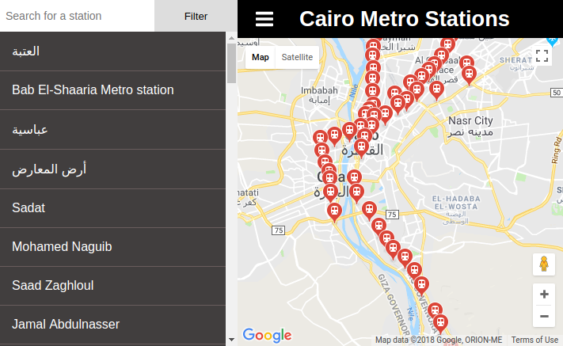

# Cairo Metro Stations

Cairo Metro Stations project is my customized version of Udacity's neighborhood map project. neighborhood map project is a requirement to graduate from Udacity frontend nanodegree.

Neighborhood map app is places listing app, where to choose certain places, render them on map and then allow the user to filter through them.

The version here, Cairo metro stations, takes Cairo (Egypt) metro stations as its base places, and then do the same with them, render and filter them.

Local Cairo metro Stations are obtained and rendered on Google maps using their provided API. After render the initial stations, the user can: - filter them and markers will change correspondingly on the map. - request further information about a station from Foursquare servers using their provided API by clicking on a stations' marker.

User Interface is split into two not-separated parts: side menu view and main view. Side menu view contains stations listings and the form to filter. Main view contains the map which show stations markers, in addition to info windows.

The app is built off React front end library and bootstrapped using create-react-app. you can check the app components architecture [below](#components-architecture)

There's a static version of the app living over [gh-pages](https://github.com/i-mw/cairo-metro-stations/tree/gh-pages) branch in this repository. This version is deployed to github pages and you can view it at https://i-mw.github.io/cairo-metro-stations/. To run your own static version, check [below](#produce-static-version)



## Table of Contents

* [Quick Start](#quick-start)
* [Installation Guides](#installation-guides)
* [Direct Dependencies](#direct-dependencies)
* [Files Structure](#files-structure)
* [Components Architecture](#components-architecture)
* [Third Parties](#third-parties)
* [Create React App](#create-react-app)
* [Contributing](#contributing)

## Quick Start

To get started developing right away:

* install all project dependencies with `npm install`
* start the development server with `npm start`

# Installation Guides

## Run Local Development Server

To run local development server you need the following tools:
* git
* node
* npm

After installing the previous tools, run these commands:

* `git clone https://github.comv/i-mw/cairo-metro-stations.git` => to download the repository
* `cd cairo-metro-stations` => to move to project directory
* `npm install` => to install all project dependencies
* `npm run` => to run local development server

N.B. You can't test service worker on development server, to do so you need to create static version. check below.

## Produce Static Version

You can produce a static version by running:
```bash
npm run build
```
after that static version will be available at `cairo-metro-stations/build`

The project is customized to view the static version correctly wherever you deploy it

N.B.: There's a static version of the app living over [gh-pages](https://github.com/i-mw/cairo-metro-stations/tree/gh-pages) branch in this repository. This version is deployed to github pages and you can view it at https://i-mw.github.io/cairo-metro-stations/

## View/Deploy Static Version

To view or deploy the produced static version, you have 3 options: 

* ### View locally
    To view your static version locally, you need a static server. You can't run it using `index.html` file, that's because local files don't have hostname and its a requirement for the project to run.

    run:
    
    `npm install -g serve` => to install static server

    `serve -s build` => to run static server

* ### Deploy to github pages
    To publish on a standalone repository for the static version, do the following:
    * create github repository
    * build the static version as mentioned above
    * isolate build folder out of the project repository and create independent local repository for it
    * push your new repository to github repository `git push origin master`
    * from settings, publish your website using `master` branch

    To publish using the repository of the same project, use `gh-pages` interface:
    * `npm install gh-pages --save-dev` => to install gh-pages
    * `git remote add origin <remote repo>` to link your github repository
    * npm run deploy => to build and publish your static version

    N.b. on deploying to github pages, you need to add custom `404.html` page next to and contain the same content of `index.html` to handle routeing of the app.

* ### Deploy to custom server
    To do so, you need to:
    * build the static version as mentioned above
    * upload `build` folder to your server
    * handle 404 and routeing

## Service Worker

Service worker is created defaultly by create-react-app [which bootstrapped this project](#create-react-app). This service worker provides automatic caching for main app resources.

Create-react-app's default service worker **doesn't run on development server**, So to test it you need to produce static version as [mentioned above](#produce-static-version) or simply run the following commands:
```
npm install -g serve
npm run build
npm serve -s build
```
Or you can simply test it on the deployed static version on github, here:
https://i-mw.github.io/cairo-metro-stations/

## Direct Dependencies

The project has these direct code dependencies, as indicated in `package.json` file:
* react
* react-dom
* propTypes

And one Development dependency:
* react-scripts

## Files Structure

```bash
├── CONTRIBUTING.md
├── README.md - This file.
├── package.json # npm package manager file.
├── public
│   ├── favicon.ico # React Icon, You may change if you wish.
│   ├── screenshot.png # Screenshot shown here in README
│   └── index.html # DO NOT MODIFY
└── src
    ├── App.css # Styles for the app.
    ├── App.js # This is the root Component of the app.
    ├── App.test.js # Used for testing. Provided with Create React App.
    ├── API.js # Contains all the requests to be fired to servers.
    ├── assets # Helpful images for app.
    │   ├── menu.svg
    │   ├── loading.gif
    │   └── loading2.gif
    ├── index.css # Global styles.
    ├── Map.js # React component.
    ├── List.js # React component.
    ├── registerServiceWorker.js # Registers service worker.
    └── index.js # This file is used for DOM rendering only.
```

## Components Architecture

```bash
App
├── Map # Main view
└── List # Side menu view
```

## Third Parties

The app retrieves data from two third parties:
* [Google maps](https://maps.google.com) : for maps and places (stations) details.
* [Foursquare](https://foursquare.com) : for places (stations) extra details.

## Create React App

This project was bootstrapped with [Create React App](https://github.com/facebookincubator/create-react-app). You can find more information [here](https://github.com/facebookincubator/create-react-app/blob/master/packages/react-scripts/template/README.md).

## Contributing

As this project is part of a program and meant only for personal improvement, Its not open for contribution. But you can refer to a feature or a bug in Issues section.

For details, check out [CONTRIBUTING.md](CONTRIBUTING.md).
